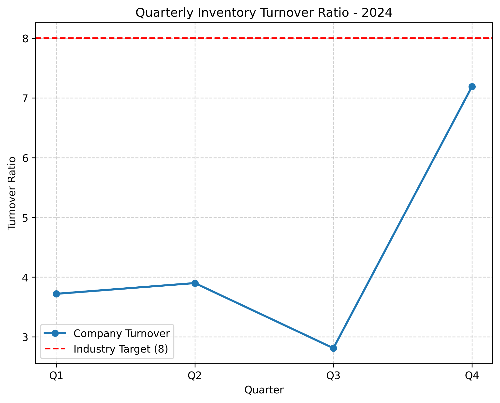

# Retail Inventory Turnover Analysis (2024)

**Analyst:** Shiva Varshney  
**Email (verification):** 22f3001416@ds.study.iitm.ac.in  

## Dataset
| Quarter | Turnover |
|---------|----------|
| Q1      | 3.72     |
| Q2      | 3.90     |
| Q3      | 2.81     |
| Q4      | 7.19     |

**Average (2024): 4.41**  
**Industry Target: 8**

---

## Key Findings
- The company’s **average turnover ratio (4.41)** is significantly below the **industry benchmark (8)**.  
- Q3 (2.81) represents a critical dip, likely due to overstocking and weak demand forecasting.  
- Q4 (7.19) shows recovery, suggesting corrective measures had some effect but remain insufficient to meet the benchmark.

---

## Business Implications
- **Excess Inventory** → Higher storage costs, capital lock-up, and reduced cash flow.  
- **Operational Inefficiencies** → Slow-moving stock reduces responsiveness to demand shifts.  
- **Strategic Risk** → Falling behind competitors with more agile supply chains.

---

## Recommendations
To close the performance gap and reach the industry target of **8**, management should:

1. **Optimize Supply Chain**  
   - Streamline vendor contracts  
   - Reduce lead times  
   - Adopt just-in-time (JIT) strategies  

2. **Enhance Demand Forecasting**  
   - Use predictive analytics (machine learning on sales data)  
   - Incorporate external signals (seasonality, macroeconomic indicators)  
   - Regularly align procurement with real-time demand signals  

---

## Visualization

---

## Conclusion
By focusing on **supply chain optimization and demand forecasting**, the company can:  
- Minimize excess inventory  
- Improve capital efficiency  
- Achieve the target turnover ratio of **8**, aligning with industry best practices.  
